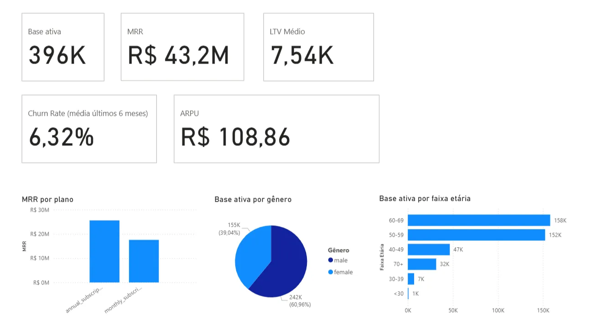
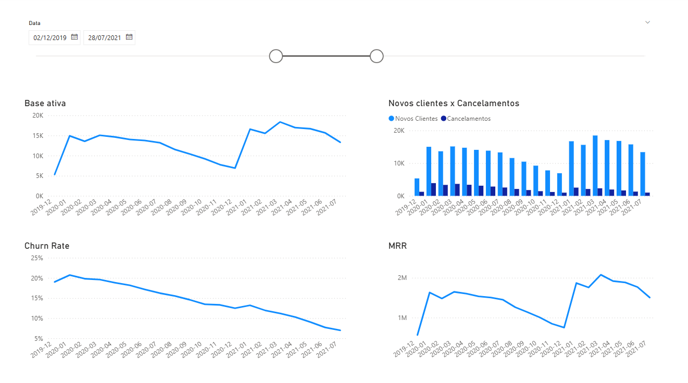
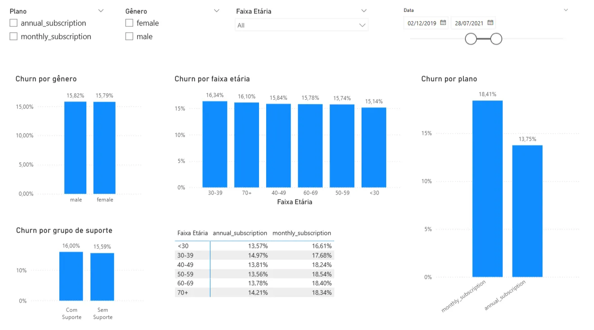
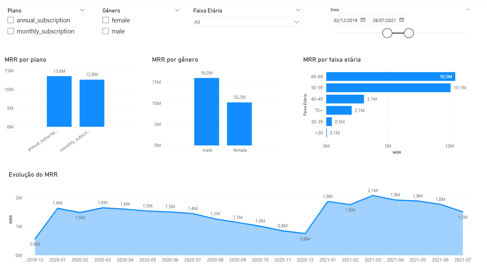
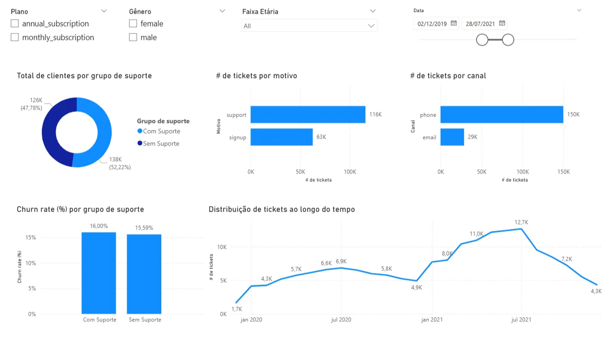

# 📊 Executive SaaS Product Dashboard with Power BI

This project simulates a real-world scenario for a data analyst working at a SaaS company.

The goal was to build an **executive dashboard** to support leadership in data-driven decision-making, with a special focus on **customer retention, product engagement, and revenue generation**.

> 🔗 Public dataset available on [Kaggle](https://www.kaggle.com/datasets/gsagar12/dspp1)  
> ⚠️ The dashboard file (`.pbix`) was built in **Portuguese**, but all business logic and structure are explained here.

---

## 📌 The Challenge

### 🧭 Context

The fictitious company offers two types of plans (monthly and annual) and already has a significant customer base. Based on that, several questions arise:

- How is retention evolving over time?
- What is the average customer lifetime by plan type?
- Which customers churn the most — and why?
- Is there a relationship between support usage and churn?

This project was an opportunity to apply data modeling, DAX, and strategic visualization in Power BI to solve real business problems.

### 📂 Dataset Used

The dataset is composed of four `.csv` files simulating customer lifecycle and support interaction data:

- `customer_info.csv`: demographic information (age and gender)
- `customer_product.csv`: subscription start/end dates and plan type
- `product_info.csv`: product details (billing type and price)
- `customer_cases.csv`: support tickets, including channel and reason

---

## 👣 Project Workflow

### 1. Exploration and Planning

Before modeling, I explored the tables and defined key business questions such as:

- How is revenue evolving?
- What does the active base look like?
- Do gender and age affect churn or revenue?
- Does support usage impact retention?

These questions helped shape the dashboard layout and ensured a clear focus from the beginning.

### 2. Data Cleaning and Modeling

- Removed irrelevant columns and fixed data types
- Created a **calendar table** for time-based analysis
- Designed a **snowflake schema** to link customers, products, and events
- Created helper columns:
  - Age Group (based on customer age)
  - Monthly Price Equivalent (based on billing cycle)

### 3. DAX Measures

I grouped the measures into two categories:

- **`SS_` (Snapshot)**: independent of date filters, reflect the current state
  - Current MRR, ARPU, Average LTV, Churn Rate (6-month avg)
- **`TMP_` (Time-based)**: designed for time series visualizations
  - Active customers, New customers, Cancellations, Revenue, Churn

💡 I tested each measure in isolation while building them, which helped validate calculations along the way. I also used a consistent naming pattern to keep everything organized and reusable.

### 4. Visualizations

The dashboard was structured into **5 thematic pages**, each addressing a specific analytical angle:

1. **Snapshot**  
   High-level KPIs: active customers, MRR, ARPU, customer profile, and revenue by plan type.

2. **Time Evolution**  
   Monthly trends: customer base, churn, revenue, and inflow/outflow dynamics.

3. **Churn and Customer Profile**  
   Analysis of cancellations by age group, gender, plan type, and support usage.

4. **Revenue by Product and Segment**  
   Revenue by product, age group, and gender — including cross-segment analysis.

5. **Support and Retention**  
   Exploration of the relationship between support usage and churn: channels, reasons, and frequency.

---

## 📊 Final Output

Each page of the dashboard addresses a specific business question. The layout was designed to be intuitive, even for non-technical stakeholders, and to support fast, informed decision-making.

### 🔍 Page Highlights

**1. Snapshot**  
Current business overview: main KPIs and customer distribution.

  

**2. Time Evolution**  
Understanding growth dynamics, retention, and churn month by month.

  

**3. Churn and Customer Profile**  
Identifying risk profiles and churn patterns.

  

**4. Revenue by Product and Segment**  
Revenue performance by plan and customer demographics.

     

**5. Support and Retention**  
Insights into how support usage correlates with customer churn.

  

---

## 💬 Final Thoughts

I chose this case because it reflects real challenges faced by SaaS companies: understanding customer behavior, reducing churn, and making decisions based on data.

This was a great opportunity to put DAX, data modeling, and visualization into practice with a clear focus on what matters most: **actionable insights**.

### 💡 Key Learnings

- Structure and naming consistency make a big difference in project clarity
- Not every metric needs to exist from the start — but every metric created must be validated
- Visual clarity comes from both good design and good data structure

---

## 🔄 Next Steps

- Adapt the design to fit a (fictional) company’s visual identity
- Recreate this analysis in Looker Studio for comparison
- Publish an interactive online version of the dashboard

---

## 📝 License

This project is licensed under the [MIT License](./LICENSE).
